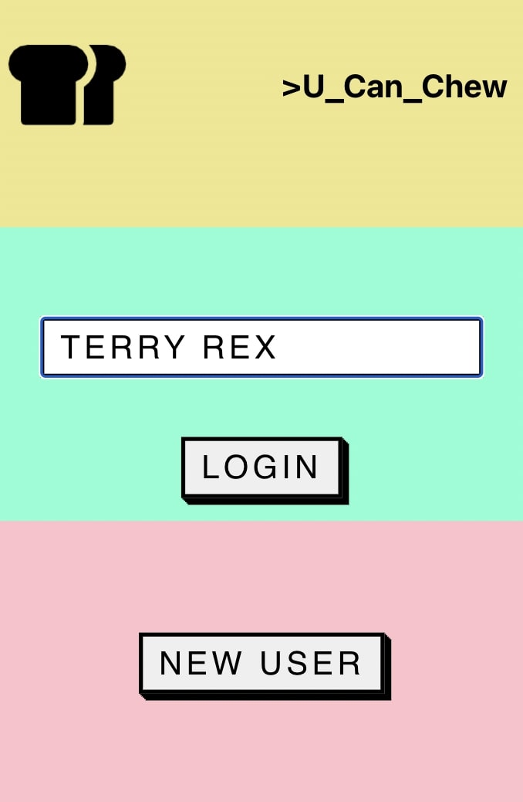
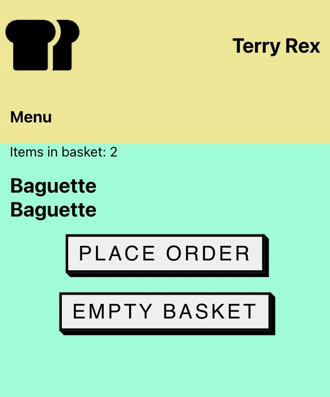

# More_Than_U_Can_Chew
# More_Than_U_Can_Chew

\>U CAN CHEW : Food Waste Ordering App Full-stack web application with React front-end, Java back-end and mobile first design. Allows bakeries to create their menu and then notify users of any food that is going to waste. Users can create accounts and it will show you bakeries near you based on geolocation, show points on maps and then allows orders to be created.

# Landing Page and User Journey

<table>
  <tr>
    <td>Homepage</td>
     <td>User Login</td>
     <td>Existing User</td>
  </tr>
  <tr>
    <td></td>
    <td></td>
    <td></td>
    </tr>
 </table>
 <table>
  <tr>
    <td>Bakeries Near You</td>
     <td>Selected Bakery</td>
     <td>Basket</td>
  </tr>
  <tr>
    <td></td>
    <td></td>
    <td></td>
    </tr>
 </table>
 <table>
  <tr>
    <td>Emptied Basket</td>
     <td>Orders</td>
     <td>New User</td>
  </tr>
  <tr>
    <td></td>
    <td></td>
    <td></td>
    </tr>
 </table>
 
 
